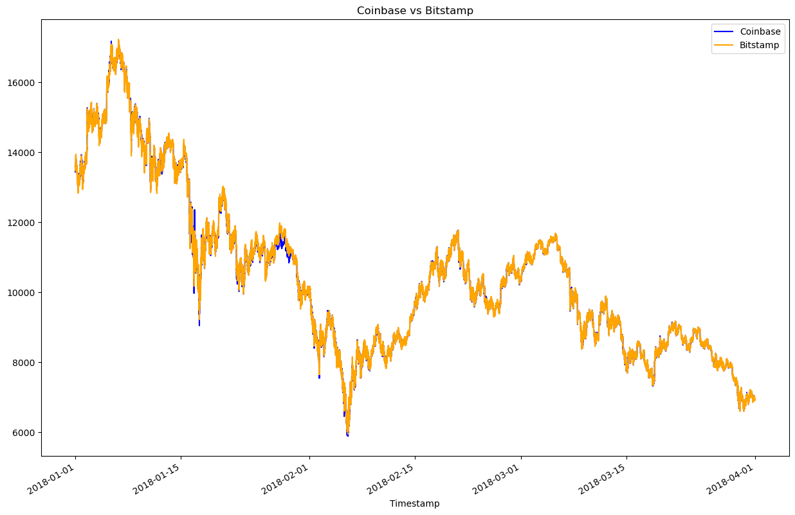

### Columbia_Module_3

## Introduction:

Welcome! Below you will find an explanation of the python script, `crypto_arbitrage`, which reads two crypto exhanges (i.e., bitstamp and coinbase) csv files and outputs potential statistical arbitrages at a specific date at your choosen. A large portion of the python script includes cleaning the raw csv files so that it can be utilized for the arbitrage calculations. By the end, the script will output potential arbitrages along with visual plots to help analyze the results. 

---

## Technologies

The code uses python version 3.7. 

Pandas, pathlib, and matplotlib are all utilized in this script. 

`Pandas` is a fast, powerful, flexible, and easy to use open source data analysis and manipulation tool. [^fn1]

`Pathlib` provides an easier method to interact with the filesystem no matter what the operating system is. [^fn2]

`Matplotlib` is a comprehensive library for creating static, animated, and interacted visualizations in Python. [^fn3]

[To learn more about Pandas](https://pandas.pydata.org/)

[To learn more about Pathlib](https://docs.python.org/3/library/pathlib.html)

[To learn more about Matplotlib](https://matplotlib.org/)

---

## Installation Guide:

The `crypto_arbitrage` script begins with adding the following libraries:

```python
import pandas as pd
from pathlib import Path 
%matplotlib inline
```

---

## Usage:

# 1. Collect the Data

Using Pandas `read_csv` function, import the data. Set the Datetimeindex as Timestamp and parse and format the dates.

```python
# bistamp.csv

bitstamp = pd.read_csv(
    Path('Resources/bitstamp.csv'),
    index_col = 'Timestamp',
    parse_dates = True,
    infer_datetime_format = True)

# coinbase.csv

coinbase = pd.read_csv(
    Path('Resources/coinbase.csv'),
    index_col = "Timestamp",
    parse_dates = True,
    infer_datetime_format = True)
```

# 2. Prepare the Data

To further prepare the data for analysis, the script cleans the data by removing the "$" in the Close column, coverts the Close column to a float type, drop any NaN values in all columns, and drops and duplicated values.

# 3. Analyze the Data 

The analysis for this arbitrage trade will only consists of the closing price. To do this, the script uses the .loc function.

```python
bitstamp_sliced = bitstamp.loc[:,"Close"]

coinbase_sliced = coinbase.loc[:,"Close"]
```

Next, a summary of the statistics can be viewed: 

```python

bitstamp_sliced.describe()

coinbase_sliced.describe()
```

Plotting the overlay of the two closing prices gives a visual presentation of areas that might be of interest for the arbitrage trade. To do this, consider the following code.

```python
coinbase_sliced.plot(
    legend = True, 
    figsize=(15,10),
    title = "Coinbase vs Bitstamp", 
    color = "blue",
    label = "Coinbase"
)
bitstamp_sliced.plot(
    legend = True, 
    figsize=(15,10),
    color="orange",
    label="Bitstamp"
)
```

> The above code will plot as follows: 



Next, separating the code by focusing on specific days will enhance the visual presentation of the spread between the two exhanges, coinbase and bitstamp. This will allow you to pick specific dates.

The three dates of interest for a possible arbitrage include: 01/16/2018, 02/05/2018, and 03/14/2018. 
---

## Citations: 

[^fn1]: “Pandas.” Pydata.org, https://pandas.pydata.org/. Accessed 17 Apr. 2023.

[^fn2]: Jalli, Artturi. “Python Pathlib Is Better than the OS Module for Handling Files. Here’s How to Use It.” Built In, 16 Sept. 2022, https://builtin.com/software-engineering-perspectives/python-pathlib.

[^fn3]: “Matplotlib — Visualization with Python.” Matplotlib.org, https://matplotlib.org/. Accessed 17 Apr. 2023.


