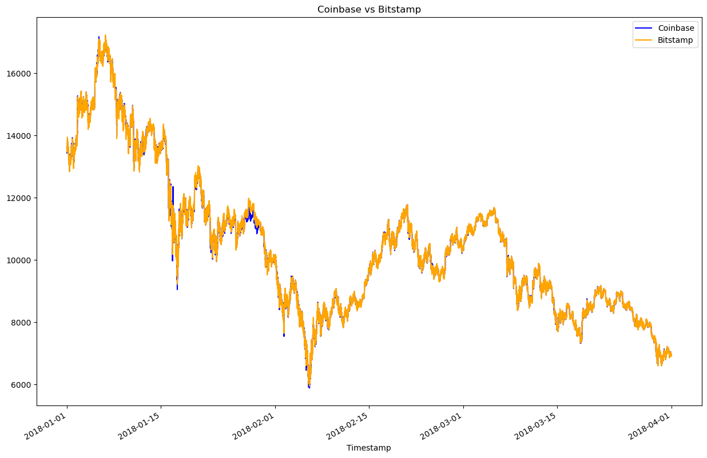

# Columbia_Module_3

## Introduction:

Welcome! Below you will find an explanation of the python script, `crypto_arbitrage`, which reads two crypto exhanges (i.e., bitstamp and coinbase) csv files and outputs potential statistical arbitrages at a specific date at your choosen. A large portion of the python script includes cleaning the raw csv files so that it can be utilized for the arbitrage calculations. By the end, the script will output potential arbitrages along with visual plots to help analyze the results. 

---

## Technologies

The code uses python version 3.7. 

Pandas, pathlib, and matplotlib are all utilized in this script. 

`Pandas` is a fast, powerful, flexible, and easy to use open source data analysis and manipulation tool. [^fn1]

`Pathlib` provides an easier method to interact with the filesystem no matter what the operating system is. [^fn2]

`Matplotlib` is a comprehensive library for creating static, animated, and interacted visualizations in Python. [^fn3]

[To learn more about Pandas](https://pandas.pydata.org/)

[To learn more about Pathlib](https://docs.python.org/3/library/pathlib.html)

[To learn more about Matplotlib](https://matplotlib.org/)

---

## Resources: 

[Resources Folder](/Resources/)

[Arbitrage Code](/crypto_arbitrage.ipynb)

## Installation Guide:

The `crypto_arbitrage` script begins with adding the following libraries:

```python
import pandas as pd
from pathlib import Path 
%matplotlib inline
```

---

## Usage:

### 1. Collect the Data

Using Pandas `read_csv` function, import the data. Set the Datetimeindex as Timestamp and parse and format the dates.

```python
# bistamp.csv

bitstamp = pd.read_csv(
    Path('Resources/bitstamp.csv'),
    index_col = 'Timestamp',
    parse_dates = True,
    infer_datetime_format = True)

# coinbase.csv

coinbase = pd.read_csv(
    Path('Resources/coinbase.csv'),
    index_col = "Timestamp",
    parse_dates = True,
    infer_datetime_format = True)
```

### 2. Prepare the Data

To further prepare the data for analysis, the script cleans the data by removing the "$" in the Close column, coverts the Close column to a float type, drop any NaN values in all columns, and drops and duplicated values.

### 3. Analyze the Data 

The analysis for this arbitrage trade will only consists of the closing price. To do this, the script uses the .loc function.

```python
bitstamp_sliced = bitstamp.loc[:,"Close"]

coinbase_sliced = coinbase.loc[:,"Close"]
```

Next, a summary of the statistics can be viewed: 

```python

bitstamp_sliced.describe()

coinbase_sliced.describe()
```

Plotting the overlay of the two closing prices gives a visual presentation of areas that might be of interest for the arbitrage trade. To do this, consider the following code.

```python
coinbase_sliced.plot(
    legend = True, 
    figsize=(15,10),
    title = "Coinbase vs Bitstamp", 
    color = "blue",
    label = "Coinbase"
)
bitstamp_sliced.plot(
    legend = True, 
    figsize=(15,10),
    color="orange",
    label="Bitstamp"
)
```

> The above code will plot the following: 



Next, focusing on specific days will enhance the visual presentation of the spread between the two exhanges, coinbase and bitstamp. This will allow you to pick specific dates.

### 4. Focus your Analysis on Specific Dates 

As an example, the three dates of interest for a possible arbitrage include: 01/16/2018, 02/05/2018, and 03/14/2018. 

>Side Note: For the purposes of this example, the early period (01/16/2018) will be used for the remainder of this educational README.

Subtracting the closing price on a given day between the two exchanges will give a delta that we can use to pull up basic statistics to determine if this period of time has a suitable spread of price that could be used for the arbitrage trade. Using the `describe()` function will generate the statistics. Using a box plot will allow to visualize if there are a suitable amount of outlier tails to be profitable on this day.

Analyzing the box plot below, it can be easily shown that there is a wide spread given the amount of outliers. 


### 5. Calculate the Arbitrage Profits 

To begin, measure the arbitrage spread between the two exchanges by subtracting the lower-priced exchange from the higher-priced exchange. Then by creating a conditional statement where the spread is greater than zero will allow the script to focus on only the profitable trades. 

```python
# Subtract the lower priced exchange from the higher priced exchange
arbitrage_spread_early = bitstamp_sliced['2018-01-16'] - coinbase_sliced['2018-01-16']

# create a conditional statement to only keep values where the spread is greater than zero
arb_spread_early = arbitrage_spread_early[arbitrage_spread_early > 0]
```
Next, the script divides the instances that have a positive arbitrage spread by the Bitcoin from the lower exchange that you would like to buy (that is the exchange with the lower price)

```python
spread_return_early = arb_spread_early / coinbase_sliced.loc['2018-01-16']
```

To even further scope in on only the most profitable trades, the script will return anything that exceeds over 1% in profit which is the minimum threshold needed to cover the costs in this example. 

```python
profitable_trades_early = spread_return_early[spread_return_early > 0.01]
```

Now the script can analyze calculate the potential profit, in dollars, per trade. 

```python
profit_early = profitable_trades_early * coinbase_sliced.loc['2018-01-16']
```


Lastly, the cumulative profits can be determined as such:

```python
cumulative_profit_early = profit_per_trade_early.cumsum()
```

A plot of this visually shows how profitable (or not) this trade is. 


---

## Contributors: 

Alex Novis 
Columbia Fintech Bootcamp

## Citations: 

[^fn1]: “Pandas.” Pydata.org, https://pandas.pydata.org/. Accessed 17 Apr. 2023.

[^fn2]: Jalli, Artturi. “Python Pathlib Is Better than the OS Module for Handling Files. Here’s How to Use It.” Built In, 16 Sept. 2022, https://builtin.com/software-engineering-perspectives/python-pathlib.

[^fn3]: “Matplotlib — Visualization with Python.” Matplotlib.org, https://matplotlib.org/. Accessed 17 Apr. 2023.


